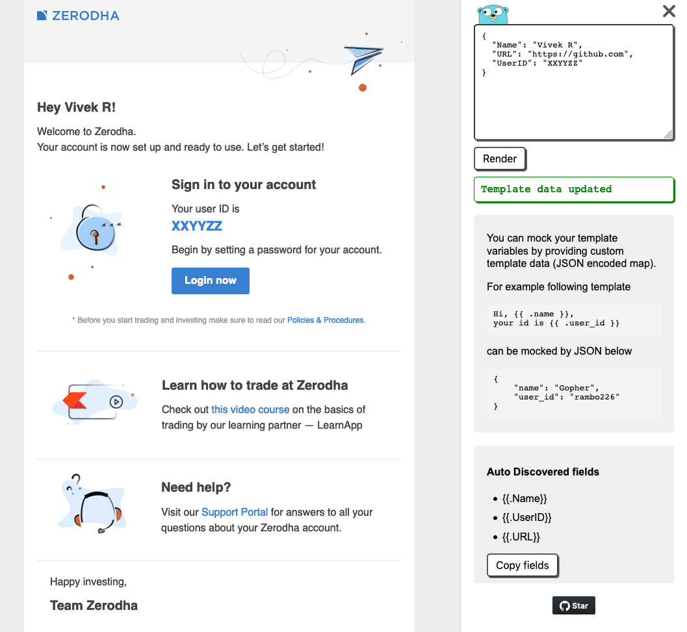

# Go Template Previewer

Simple utility to live edit Go template and preview with custom data.



## Installation

Download the latest release from the [releases page](https://github.com/vividvilla/gotp/releases) or clone this repository and run `make deps` && `make build`.

## Usage

```txt
Go template previewer - Live preview Go templates with custom data.

Usage:
gotp sample.tmpl
gotp --base-tmpl base.tmpl sample.tmpl
gotp --base-tmpl base.tmpl sample.tmpl --data '{"name": "Gopher"}'
gotp --base-tmpl base/*.tmpl sample.tmpl
gotp --base-tmpl base.tmpl sample.tmpl
gotp --web sample.tmpl
gotp --web --addr :9000 sample.tmpl
gotp --web --base-tmpl base.tmpl sample.tmpl

  -a, --addr string             Address to start the server on. (default ":1111")
  -b, --base-tmpl stringArray   Base template, or glob pattern.
  -d, --data string             Template data.
      --sprig                   Enable sprig functions
  -v, --version                 Version info
  -w, --web                     Run web UI
```

It can run in either `commandline` or `web` mode. Commandline mode renders the template on stdout and
web mode runs a web server which provides UI to update template data and live rendering when template changes.

```bash
# Renders sample.tmpl on stdout.
gotp sample.tmpl

# If your template uses base templates then you can specify it as a commandline flag.
gotp --base-tmpl base.tmpl sample.tmpl

# If your template uses Sprig template functions you can specify a flag.
gotp --sprig --base-tmpl base.tmpl sample.tmpl

# If there are multiple base templates then you can repeat the flag.
gotp --base-tmpl base-header.tmpl --base-tmpl base-footer.tmpl sample.tmpl

# You can also use glob pattern to specify multiple base templates.
gotp --base-tmpl "base-*.tmpl" sample.tmpl

# Specify the data required by templates as a JSON input. For example if your template
# has variable `{{ .name }}` then you can specify JSON data as `{ "name": "Gopher" }`.
gotp --base-tmpl base.tmpl sample.tmpl --data '{"name": "Gopher"}'

# You can do all of the above commands with `--web` flag to start a web server which renders the output.
gotp --web --base-tmpl base.tmpl sample.tmpl --data '{"name": "Gopher"}'

# By default web server runs on `:1111` you can change it by using `--addr`flag.
gotp --web --addr :9000 --base-tmpl base.tmpl sample.tmpl
```

## Caveats

Currently there is no support for custom Go template functions and pipelines. Although, you can use the `--sprig` flag to enable [Sprig template functions](http://masterminds.github.io/sprig/).
